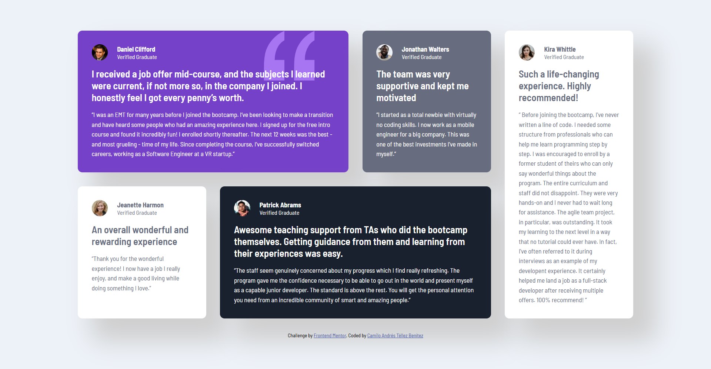

# Solución al reto "Testimonials grid section solution"

Esta es mi solución al desafío [Testimonials grid section challenge on Frontend Mentor](https://www.frontendmentor.io/challenges/testimonials-grid-section-Nnw6J7Un7).

## Tabla de Contenidos

- [Descripción General](#descripción-general)
  - [El Desafío](#el-desafío)
  - [Captura de Pantalla](#captura-de-pantalla)
  - [Enlace al Proyecto](#enlace-al-proyecto)
- [Mi Proceso](#mi-proceso)
  - [Tecnologías Utilizadas](#tecnologías-utilizadas)
- [Sobre Mí](#sobre-mí)

## Descripción General

### El Desafío

El objetivo de este reto era:

- implementar un diseño responsivo que se adaptara correctamente a distintos tamaños de pantalla.

### Captura de Pantalla

A continuación, se muestra una vista previa del resultado final en una pantalla de escritorio:

### Enlace al Proyecto

- [Ver el sitio en línea](https://your-solution-url.com)

## Mi Proceso

### Tecnologías Utilizadas

Para desarrollar este proyecto, utilicé las siguientes herramientas y tecnologías:

- **HTML5 semántico** para una estructura clara y accesible.
- **CSS3 con variables personalizadas** para mantener consistencia en los estilos.
- **Flexbox** para una distribución flexible y adaptable de los elementos.
- **CSS Grid** para una estructura de cuadrícula robusta.
- Enfoque **mobile-first** para garantizar una experiencia óptima en dispositivos móviles.

## Sobre Mí

Si quieres conocer más sobre mi, puedes encontrarme en:

- [LinkedIn](http://www.linkedin.com/in/camilo-t%C3%A9llez)
- [Frontend Mentor](https://www.frontendmentor.io/profile/camilo-atb)
- [YouTube](https://www.youtube.com/@camilotellez887)

¡Gracias por visitar mi proyecto! 🚀